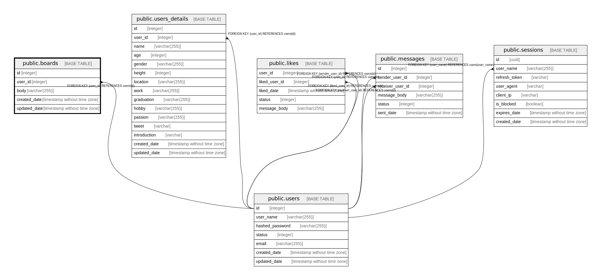

# public.boards

## Description

## Columns

| Name | Type | Default | Nullable | Children | Parents | Comment |
| ---- | ---- | ------- | -------- | -------- | ------- | ------- |
| id | integer | nextval('boards_id_seq'::regclass) | false |  |  |  |
| user_id | integer |  | true |  | [public.users](public.users.md) |  |
| body | varchar(255) |  | true |  |  |  |
| created_date | timestamp without time zone | CURRENT_TIMESTAMP | false |  |  |  |
| updated_date | timestamp without time zone | CURRENT_TIMESTAMP | false |  |  |  |

## Constraints

| Name | Type | Definition |
| ---- | ---- | ---------- |
| boards_user_id_fkey | FOREIGN KEY | FOREIGN KEY (user_id) REFERENCES users(id) |
| boards_pkey | PRIMARY KEY | PRIMARY KEY (id) |

## Indexes

| Name | Definition |
| ---- | ---------- |
| boards_pkey | CREATE UNIQUE INDEX boards_pkey ON public.boards USING btree (id) |
| boards_user_id_idx | CREATE INDEX boards_user_id_idx ON public.boards USING btree (user_id) |

## Relations

---

> Generated by [tbls](https://github.com/k1LoW/tbls)
