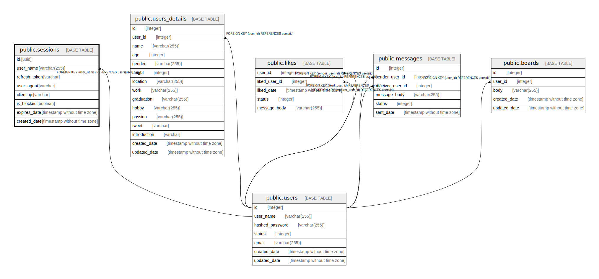

# public.sessions

## Description

## Columns

| Name | Type | Default | Nullable | Children | Parents | Comment |
| ---- | ---- | ------- | -------- | -------- | ------- | ------- |
| id | uuid |  | false |  |  |  |
| user_name | varchar(255) |  | false |  | [public.users](public.users.md) |  |
| refresh_token | varchar |  | false |  |  |  |
| user_agent | varchar |  | false |  |  |  |
| client_ip | varchar |  | false |  |  |  |
| is_blocked | boolean | false | false |  |  |  |
| expires_date | timestamp without time zone |  | false |  |  |  |
| created_date | timestamp without time zone | CURRENT_TIMESTAMP | false |  |  |  |

## Constraints

| Name | Type | Definition |
| ---- | ---- | ---------- |
| sessions_user_name_fkey | FOREIGN KEY | FOREIGN KEY (user_name) REFERENCES users(user_name) |
| sessions_pkey | PRIMARY KEY | PRIMARY KEY (id) |
| sessions_user_name_key | UNIQUE | UNIQUE (user_name) |

## Indexes

| Name | Definition |
| ---- | ---------- |
| sessions_pkey | CREATE UNIQUE INDEX sessions_pkey ON public.sessions USING btree (id) |
| sessions_user_name_key | CREATE UNIQUE INDEX sessions_user_name_key ON public.sessions USING btree (user_name) |

## Relations

---

> Generated by [tbls](https://github.com/k1LoW/tbls)
