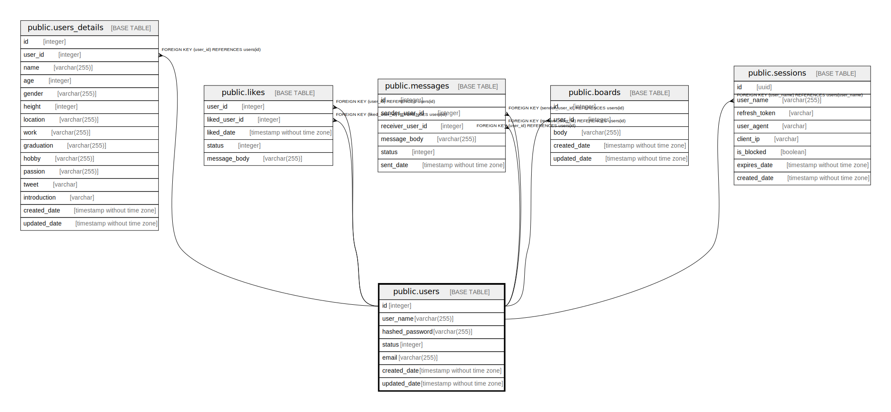

# public.users

## Description

## Columns

| Name | Type | Default | Nullable | Children | Parents | Comment |
| ---- | ---- | ------- | -------- | -------- | ------- | ------- |
| id | integer | nextval('users_id_seq'::regclass) | false |  |  |  |
| user_name | varchar(255) |  | false |  |  |  |
| hashed_password | varchar(255) |  | false |  |  |  |
| status | integer | 1 | false |  |  |  |
| email | varchar(255) |  | false |  |  |  |
| created_date | timestamp without time zone | CURRENT_TIMESTAMP | false |  |  |  |
| updated_date | timestamp without time zone | CURRENT_TIMESTAMP | false |  |  |  |

## Constraints

| Name | Type | Definition |
| ---- | ---- | ---------- |
| users_pkey | PRIMARY KEY | PRIMARY KEY (id) |
| users_user_name_key | UNIQUE | UNIQUE (user_name) |

## Indexes

| Name | Definition |
| ---- | ---------- |
| users_pkey | CREATE UNIQUE INDEX users_pkey ON public.users USING btree (id) |
| users_user_name_key | CREATE UNIQUE INDEX users_user_name_key ON public.users USING btree (user_name) |

## Relations

---

> Generated by [tbls](https://github.com/k1LoW/tbls)
