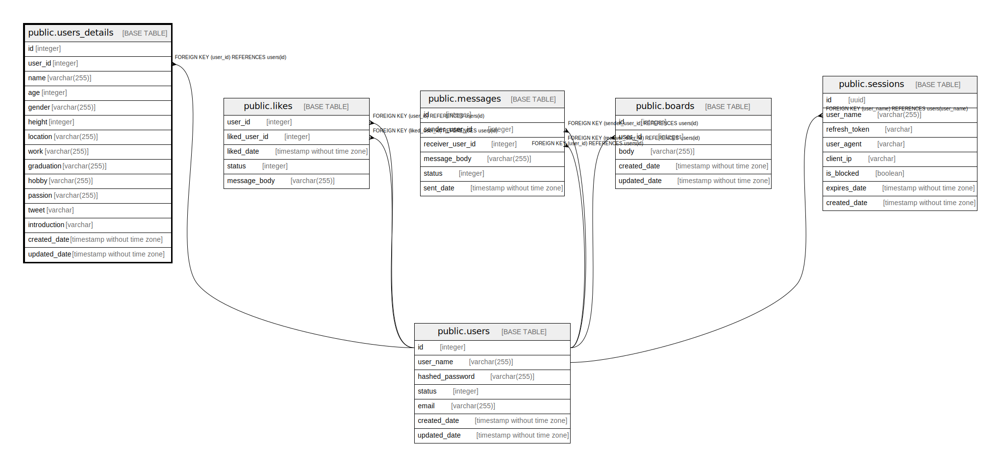

# public.users_details

## Description

## Columns

| Name | Type | Default | Nullable | Children | Parents | Comment |
| ---- | ---- | ------- | -------- | -------- | ------- | ------- |
| id | integer | nextval('users_details_id_seq'::regclass) | false |  |  |  |
| user_id | integer |  | true |  | [public.users](public.users.md) |  |
| name | varchar(255) |  | false |  |  |  |
| age | integer |  | false |  |  |  |
| gender | varchar(255) |  | false |  |  |  |
| height | integer |  | true |  |  |  |
| location | varchar(255) |  | true |  |  |  |
| work | varchar(255) |  | true |  |  |  |
| graduation | varchar(255) |  | true |  |  |  |
| hobby | varchar(255) |  | true |  |  |  |
| passion | varchar(255) |  | true |  |  |  |
| tweet | varchar |  | true |  |  |  |
| introduction | varchar |  | true |  |  |  |
| created_date | timestamp without time zone | CURRENT_TIMESTAMP | false |  |  |  |
| updated_date | timestamp without time zone | CURRENT_TIMESTAMP | false |  |  |  |

## Constraints

| Name | Type | Definition |
| ---- | ---- | ---------- |
| users_details_user_id_fkey | FOREIGN KEY | FOREIGN KEY (user_id) REFERENCES users(id) |
| users_details_pkey | PRIMARY KEY | PRIMARY KEY (id) |

## Indexes

| Name | Definition |
| ---- | ---------- |
| users_details_pkey | CREATE UNIQUE INDEX users_details_pkey ON public.users_details USING btree (id) |
| users_details_user_id_idx | CREATE INDEX users_details_user_id_idx ON public.users_details USING btree (user_id) |

## Relations

---

> Generated by [tbls](https://github.com/k1LoW/tbls)
